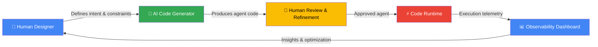

<!--
  Open Graph Meta Tags (for link previews)
  <meta property="og:title" content="Agents In Code — The Compiler for AI Agents" />
  <meta property="og:description" content="Design, build, and run production AI agents that are 10x faster, 90%+ cheaper, and enterprise-secure. The future of AI agents isn't more AI — it's smarter code." />
  <meta property="og:type" content="website" />
  <meta property="og:image" content="https://agentsincode.com/assets/og-banner.png" />
  <meta property="og:url" content="https://github.com/agentsincode/pitch" />
  <meta name="twitter:card" content="summary_large_image" />
-->

<div align="center">

# 🏗️ AGENTS IN CODE

### **The Compiler for AI Agents**

*Stop running agents on hope. Start running them on code.*

**Design, build, and deploy production AI agents that are 10× faster, 90%+ cheaper, and enterprise-secure — by shifting intelligence from runtime to design time.**

[]()
[]()
[]()
[]()

---

*The AI agent market is exploding. But most agents are fragile, expensive, unpredictable, and impossible to observe in production. We fix all of that — not by building a better AI runtime, but by eliminating the need for one.*

---

[The Problem](#-the-problem) · [The Solution](#-the-solution) · [How It Works](#-how-it-works) · [Market Opportunity](#-market-opportunity) · [Business Model](#-business-model) · [The Ask](#-the-ask) · [Contact](#-contact)

</div>

---

## 🔥 The Problem

### AI Agents Are Broken in Production

The industry is building AI agents the wrong way. Today's agent frameworks treat LLMs as **runtime engines** — making expensive, unpredictable API calls for every decision, every step, every execution. The result?

| Pain Point | Reality in Production |
|---|---|
| 💸 **Runaway Costs** | Enterprise teams report **$10K–$100K+/month** in LLM API costs for agent workloads that deliver marginal ROI |
| 🐌 **Unpredictable Latency** | Agents that chain 5–15 LLM calls per task create **30–120 second wait times** and timeout failures |
| 🔓 **Security Nightmares** | Prompt injection, data leakage, and hallucination-driven actions make compliance teams lose sleep |
| 🕳️ **Zero Observability** | When an agent fails at step 7 of 12, teams have **no structured logs, no stack traces, no debugger** — just a blob of natural language |
| 🎲 **Non-Determinism** | The same input produces different outputs. Every. Single. Time. Try explaining that to an auditor |
| 📈 **Doesn't Scale** | Costs and latency scale **linearly** (or worse) with usage — the opposite of software economics |

> **The root cause:** The industry conflated *intelligence at design time* with *intelligence at runtime*. You don't need an LLM to decide what to do on every invocation — you need it to help **write the code once** that handles it deterministically forever.

### The $4.1B Question

Enterprises want AI agents. **82% of Fortune 500 companies** plan to deploy AI agents by 2027 (Gartner, 2024). But the current approach is fundamentally unfit for production workloads that require **reliability, cost predictability, security compliance, and auditability**.

There is a massive gap between the *demo* and the *deployment*. We close it.

---

## 💡 The Solution

### Agents In Code: Where AI Designs It, Code Runs It

**Agents In Code** is a platform for designing, building, and running **highly secure, observable, and cost-efficient task agents** that execute primarily in code — not in an AI-centric runtime.

We introduce a paradigm we call **Crafted Compilation™**: the practice of leveraging **human design intent** combined with **AI-powered code generation** to produce agents that run as **deterministic, auditable, blazing-fast software** — not as expensive, fragile LLM call chains.

<div align="center">

```
┌─────────────────────────────────────────────────────────┐
│                   DESIGN TIME (AI-Assisted)              │
│                                                          │
│   👤 Human defines intent, logic, guardrails, policies   │
│   🤖 AI writes the code, tests, and deployment config    │
│   ✅ Human reviews, refines, and approves                │
│                                                          │
├─────────────────────────────────────────────────────────┤
│                   RUN TIME (Code-Driven)                 │
│                                                          │
│   ⚡ Deterministic execution — no LLM in the loop       │
│   🔒 Sandboxed, auditable, policy-enforced               │
│   📊 Full observability — logs, traces, metrics          │
│   💰 Near-zero marginal cost per execution               │
│                                                          │
└─────────────────────────────────────────────────────────┘
```

</div>

### The Key Insight

> **AI is brilliant at writing code. Code is brilliant at running tasks. So let AI write the code, and let code run the tasks.**

LLMs are used **at design time** to generate, optimize, and iterate on agent logic. But at **runtime**, the agent executes as compiled, structured code — with LLM calls reserved only for the rare moments that genuinely require dynamic intelligence (e.g., unstructured content interpretation).

The result: agents that behave like **software**, not like **interns with a credit card**.

---

## 🎯 Key Value Propositions

<div align="center">

| | Value Prop | Impact |
|---|---|---|
| 💰 | **90%+ Model Cost Reduction** | Eliminate per-execution LLM calls. Shift AI cost to one-time design. Marginal runtime cost approaches zero. |
| ⚡ | **10× Faster Execution** | Code runs in milliseconds. No waiting on API rate limits, token generation, or retry loops. |
| 🔒 | **Enterprise-Grade Security** | No prompt injection surface at runtime. No data leakage through model APIs. Policy-enforced execution boundaries. |
| 📊 | **Radical Observability** | Structured logs, stack traces, step-by-step execution visibility. Debug agents like you debug software. |
| 🎯 | **Deterministic & Auditable** | Same input → same output. Every time. Compliant with SOX, HIPAA, SOC 2 audit requirements. |
| 📈 | **True Software Economics** | Costs scale sub-linearly. 10× the workload ≠ 10× the cost. Finally, AI that follows the economics of software. |
| 🏢 | **Google Workspace Native** | Enterprise-class identity, permissions, collaboration, and administration out of the box. Zero new infrastructure. |
| 🧑‍💻 | **Minimal Learning Curve** | Users and admins work within tools they already know. No PhD in prompt engineering required. |

</div>

---

## ⚙️ How It Works

### The Crafted Compilation™ Approach

Crafted Compilation is our core methodology — a **human-in-the-loop, AI-accelerated development pipeline** that produces production-grade agent code from high-level task descriptions.



### Step-by-Step

| Phase | What Happens | Who/What Does It |
|---|---|---|
| **1. Design** | User describes the task, defines inputs/outputs, specifies policies, guardrails, and edge cases | 👤 Human (assisted by AI suggestions) |
| **2. Generate** | AI generates structured, type-safe agent code with error handling, logging, and test coverage | 🤖 AI Code Generator |
| **3. Review** | Human reviews generated code, refines logic, adds domain expertise, approves for deployment | 👤 Human |
| **4. Deploy** | Agent is deployed to the Agents In Code runtime — a secure, sandboxed, code-first execution environment | ⚙️ Platform |
| **5. Execute** | Tasks run as deterministic code. LLM calls only for genuinely dynamic moments (if any). Millisecond execution | ⚡ Code Runtime |
| **6. Observe** | Full structured telemetry — every step logged, every decision traceable, every error debuggable | 📊 Dashboard |
| **7. Iterate** | Performance data feeds back into design. AI suggests optimizations. Humans approve. Continuous improvement | 🔄 Human + AI |

### Why "Crafted Compilation"?

Think of it like the evolution of software engineering:

| Era | Approach | Analogy |
|---|---|---|
| **Assembly** | Humans write every instruction | Hand-coded agents (2023) |
| **Compiled Languages** | Humans write high-level intent, compilers generate machine code | **Agents In Code (Now)** |
| **Interpreted/AI Runtime** | Runtime figures it out on every execution | LLM-centric agent frameworks |

The industry jumped from Assembly straight to Interpreted — skipping the most important step. **We're building the compiler.**

---

## 📊 Market Opportunity

### The AI Agent Market Is Massive — And Just Getting Started

<div align="center">

| Metric | Estimate | Source |
|---|---|---|
| **TAM** (Total Addressable Market) | **$47.1B by 2030** | Grand View Research — AI Agent Market (CAGR 45.1%) |
| **SAM** (Serviceable Addressable Market) | **$12.8B by 2030** | Enterprise AI agent platforms for task automation (Fortune 500 + Mid-Market) |
| **SOM** (Serviceable Obtainable Market) | **$640M by 2030** | 5% capture of enterprise agent platform market through code-first differentiation |

</div>

### Market Tailwinds

- 🌊 **82% of Fortune 500** plan AI agent deployment by 2027 (Gartner)
- 🌊 **$150B+ annual enterprise spend** on automation and AI tooling (McKinsey, 2024)
- 🌊 **Google Workspace has 3B+ users** — our distribution layer is already in every enterprise
- 🌊 **Cost pressure is accelerating** — CFOs are demanding ROI on AI spend; "cool demos" no longer sufficient
- 🌊 **Regulatory pressure is increasing** — EU AI Act, SOX, HIPAA all demand auditability and determinism
- 🌊 **The agent framework market is fragmented** — no dominant platform for production-grade agents has emerged

### Why Now?

1. **LLMs are finally good enough at code generation** to make Crafted Compilation viable
2. **Enterprise AI budgets are shifting** from experimentation to production — demanding reliability
3. **The cost crisis is real** — organizations are hitting $1M+ annual LLM API bills and questioning ROI
4. **Security and compliance** requirements are eliminating pure-LLM runtime approaches from enterprise consideration
5. **Google Workspace dominance** in enterprise creates an immediate, trusted distribution channel

---

## 💼 Business Model

### How We Make Money

We operate a **platform SaaS model** with multiple revenue streams designed for enterprise adoption velocity and long-term value capture.

| Revenue Stream | Model | Description |
|---|---|---|
| 🏢 **Platform Subscription** | Per-seat / Per-workspace | Tiered access to the Agents In Code design, build, and runtime platform |
| ⚡ **Execution Metering** | Per-execution (usage-based) | Runtime charges for agent execution — still 90%+ cheaper than LLM-native alternatives |
| 🔧 **Enterprise Add-ons** | Module pricing | Advanced security policies, compliance reporting, custom integrations, SLA guarantees |
| 🎓 **Professional Services** | Project-based | Agent design consulting, migration from LLM-native frameworks, custom development |
| 🏪 **Agent Marketplace** (Future) | Revenue share | Third-party agents and templates — platform network effects |

### Unit Economics (Target)

| Metric | Target |
|---|---|
| **ACV** (Average Contract Value) | $25K–$250K (enterprise tier) |
| **Gross Margin** | 80%+ (code-first execution = minimal compute cost) |
| **Net Revenue Retention** | 130%+ (usage expansion within accounts) |
| **CAC Payback** | < 12 months |
| **LTV:CAC Ratio** | > 5:1 |

### The Pricing Wedge

Our pricing strategy exploits a powerful dynamic: **we save customers money while making money**.

> A customer paying $50K/month in LLM API costs switches to Agents In Code for $5K/month in platform fees. They save $45K/month. We earn $5K/month at 85%+ margin. **Everyone wins.**

This creates an **irresistible ROI story** for procurement — the platform **pays for itself on day one**.

---

## 🏰 Competitive Advantages & Moat

### Why Us. Why Now. Why It's Hard to Copy.

| Advantage | Description | Defensibility |
|---|---|---|
| 🧠 **Paradigm Shift** | We're not building a better agent framework — we're building an **agent compiler**. Different category. | First-mover in code-first agent generation creates category definition advantage |
| 🏢 **Google Workspace Integration** | Deep, native integration with the platform that **3B+ users** already live in | Platform partnerships and API depth create switching costs and distribution moat |
| ⚡ **The Economics Flywheel** | Every agent built generates execution data that improves code generation → better agents → more adoption → more data | Proprietary dataset of task→code mappings compounds over time |
| 🔒 **Security Architecture** | Runtime has **no LLM attack surface**. Fundamentally different security model, not just "better guardrails" | Architectural advantage — competitors can't add this without rebuilding from scratch |
| 📊 **Observability Depth** | Code-based agents produce **structured, typed telemetry** — not natural language logs | Enables enterprise compliance use cases that LLM-native platforms structurally cannot serve |
| 🧑‍💻 **Crafted Compilation IP** | Proprietary methodology and toolchain for human-AI collaborative agent development | Trade secrets, potential patents, and continuous iteration on the core pipeline |
| 🔄 **Network Effects** | Agent templates, shared patterns, and marketplace create multi-sided network effects | Value of platform increases with each customer and agent published |

### Competitive Landscape

<div align="center">

| Capability | **Agents In Code** | LangChain / CrewAI | Microsoft Copilot Studio | OpenAI Agents | Custom Code |
|---|---|---|---|